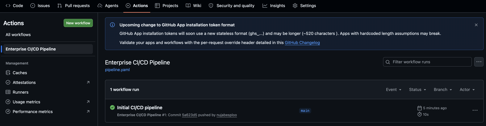
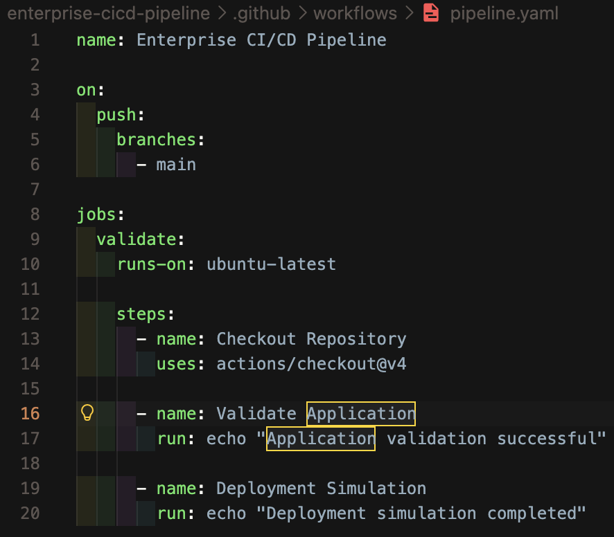
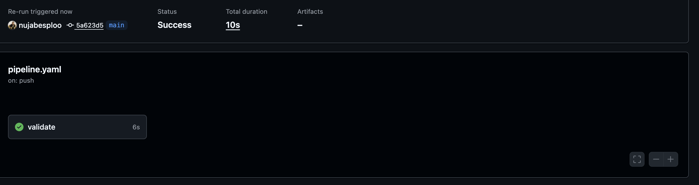
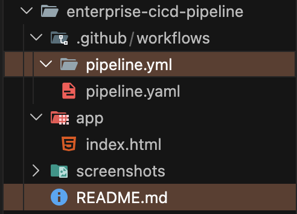

# Enterprise CI/CD Pipeline

## Overview

Designed and implemented an automated Continuous Integration pipeline using GitHub Actions to validate repository changes and streamline software delivery workflows.

The solution automatically triggers workflow execution on code commits, providing immediate feedback on repository updates and ensuring consistent deployment practices.

---

## Technologies

* GitHub Actions
* Git
* GitHub
* YAML
* Linux
* VS Code

---

## Solution Architecture

```text
Developer
   │
   ▼
Git Commit
   │
   ▼
GitHub Repository
   │
   ▼
GitHub Actions Workflow
   │
   ▼
Automated Validation
   │
   ▼
Successful Pipeline Execution
```

---

## Implementation

* Created an automated GitHub Actions workflow
* Configured pipeline triggers on repository updates
* Implemented YAML-based workflow definitions
* Executed automated validation processes
* Monitored workflow execution through GitHub Actions
* Verified successful CI pipeline runs

---

## Screenshots

### GitHub Actions Dashboard



### Workflow Configuration



### Automated Validation


### Successful Pipeline Execution



### Repository Structure



---

## Key Outcomes

* Automated repository validation
* Reduced manual verification processes
* Established CI workflow automation
* Improved development workflow visibility
* Demonstrated GitOps and DevOps practices

---

## Skills Demonstrated

* CI/CD Pipelines
* GitHub Actions
* YAML Configuration
* Version Control
* Linux Administration
* DevOps Automation

---

## Repository Structure

```text
enterprise-cicd-pipeline/
│
├── .github/
│   └── workflows/
│       └── pipeline.yaml
│
├── screenshots/
│
└── README.md
```
